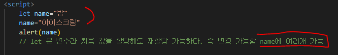

# 2일차 변수 let / 변수 var / 복합 대입 연산자(+=) / 증감연산자(전위, 후위) / typeof() → 데이터의 형태를 알아보는 함수 / Number : 자료의 형을 숫자로 바꿔주는 함수, 숫자 연산자 / String 을 이용하여 문자형으로 변경, 빈 자료형 추가(+’ ’) / 논리자료형으로 변환 Boolean / confirm 확인 취소 띄어주는 함수

꿀 팁 표시: ❤ 노랑 배경글
상태: JAVA Script
작성일시: 2022년 8월 10일 오후 10:52

# 변수 let

- **let 이름선언 = “밥”**
    - **선언한 이름 = “아이스크림”**

### ❤ **let은 변수**라 **처음 값을 할당해도 재할당이 가능**하다. 즉 우측 할당 값 변경 가능

**예시**

### ❤ **값 선언** 여러번 후 **중복 출력 가능**하다.

### ❤ **let 이름 선언은 중복이 안된다**.

<aside>
🔥 이름 **선언은 중복이 안되나 값 할당은 중복 작성 후 변경 가능**하다.

</aside>

---

# 변수 var

### ❤ **var 선언 한줄로 줄여쓰기(상수는 불가능)**

- **var currenYear,birthYear,age**; → 변수선언

### ❤ var 선언 따로, 할당 따로

- **var birthYear;**
    - **birthYear=1995;**
    
    
    

### ❤ var 선언과 할당 동시에

- **var currentYear=2022;**

### 💥 예시

**var birthYear= 을 통해서 중복 선언 한 모습**

---

# 복합 대입 연산자

### ❤ **+=**

- **let val = 10**
    
    
    
- **let val = 10**
    - **val = val+10**
    
    
    
- **let val = 10**
    - **val+=10 / 이게 복합 대입 연산자**
    - **val=val+10** 의 줄여쓰기 이게 복합 대입 연산자 / 요소를 다룰 때 많이 씀
    
    
    

### 💥 예시

**let list=’’ → 빈 컨텐츠를 꼭 넣어줘야함 가상선택자 같은 느낌**

---

# 증감연산자

### ❤ 전위

❤ **전위 : 값을 바로 계산해서 출력해준다.**

- **Y=++Y** : 전위 + → 기존 변수 값에 1 더하기
- **Y=--Y** : 전위 - → 기존 변수 값에 1 빼기

### ❤ 후위

❤ **후위 : 계산 값을 메모리에 저장 후 다음 출력 때 나오게 한다. 현재는 기존 값 출력**

- **Y=Y++** : → 기존 변수 값에 1 더하기
- **Y=--Y** : → 기존 변수 값에 1 빼기

### 💥 예시

**후위**

---

**전위**

**혼합**

---

# typeof() → 데이터의 형태를 알아보는 함수

### ❤ **typeof로 감싸면 데이터의 형태를 알 수 있다.**

### 💥예시

**‘’ 소 따움표 안에 작성 해서 문자로 인식한 상태**

---

# Number : 자료의 형을 숫자로 바꿔주는 함수, 숫자 연산자

### ❤ 자료형을 **Number()로 감싸면** 숫자형으로 바뀐다.

**위 코드를 Number로 감싸 숫자형으로 변형한 상태**

### ❤ 그 외 Number 함수 없이 다른 자료형에 숫자연산자를 사용하면 자료형이 숫자로 변환 / true = 1, false = 0

- **그냥 true를 입력하면 typeof 시 booleanr(논리형이 나오지만) 연산자 사용시 숫자로 나온다.**

---

# String 을 이용하여 문자형으로 변경, 빈 자료형 추가(+’ ’)

### ❤ 자료형을 String( )로 감싸면 문자형이 된다.

### ❤ 함수 사용하지 않고 변환 / 빈 문자형 추가하면 변환된다. **+' ’**

---

# 논리자료형으로 변환 Boolean

### ❤ Boolean으로 변환된 자료는 대부분 true 변환된다. 예외 : 0, Nan, '', null, undefined 은 false로 변환 null:비었단 뜻

---

# confirm 확인 취소 띄어주는 함수

### ❤ 확인, 취소를 누르는지에 따라 다음 값 변환한다. 화면에 출력 하면 확인 누르면 true, 취소 누르면 false

